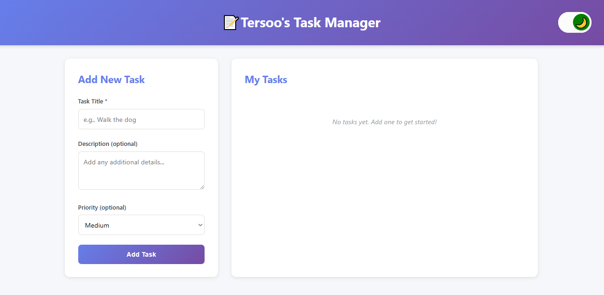
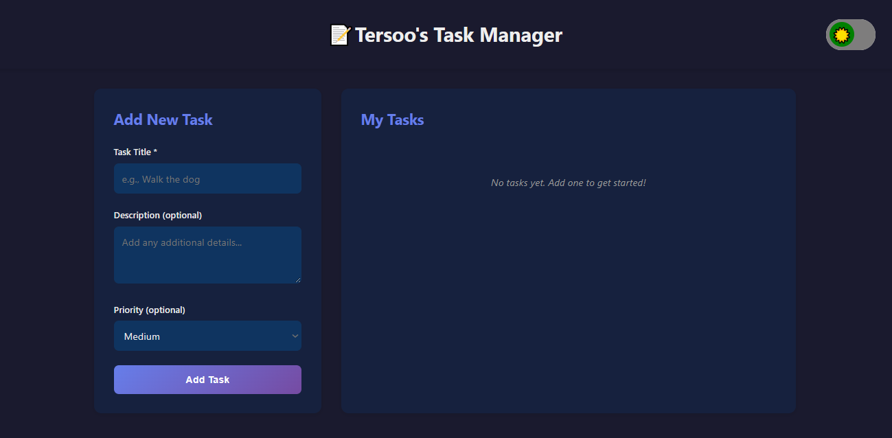
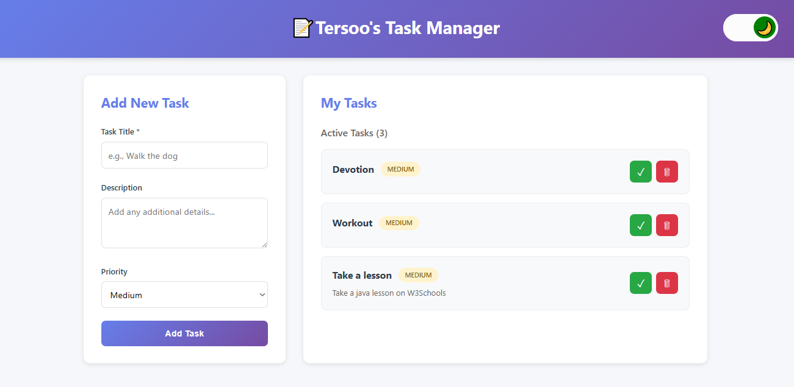
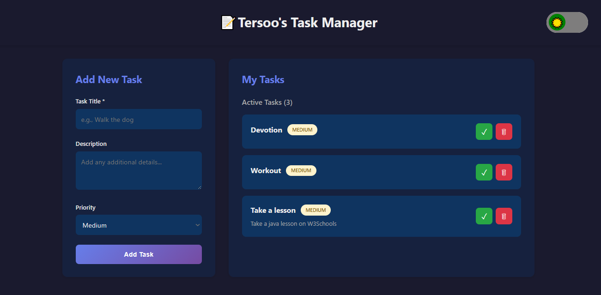

# 📝 Task Manager

A modern, feature-rich task management application built with React, TypeScript, and vanilla CSS. This project demonstrates the use of React Hooks including `useState`, `useEffect`, and `useContext` for state management and side effects.


## 📸 Screenshots

Empty task - light theme


Empty task - dark theme


Populated task - light theme


Populated task - dark theme


## ✨ Features

-   ✅ **Add Tasks** - Create tasks with title, description, and priority levels
-   🎯 **Task Management** - Mark tasks as complete or incomplete
-   🗑️ **Delete Tasks** - Remove tasks you no longer need
-   💾 **Data Persistence** - Tasks are saved to localStorage and persist across page reloads
-   🌓 **Theme Switching** - Toggle between light and dark modes
-   📱 **Responsive Design** - Works seamlessly on desktop, tablet, and mobile devices
-   🎨 **Priority Levels** - Organize tasks by Low, Medium, or High priority
-   📊 **Task Sections** - Separate views for active and completed tasks

## 🛠️ Technologies Used

-   **React 18.2.0** - UI library for building component-based interfaces
-   **TypeScript 5.0.0** - Type-safe JavaScript
-   **Vite 4.3.0** - Fast build tool and development server
-   **Vanilla CSS** - Custom styling without CSS frameworks
-   **localStorage API** - Browser storage for data persistence

## 🏁 Getting Started

### Prerequisites

Make sure you have the following installed:

-   **Node.js** (version 16.0 or higher)
-   **npm** (version 7.0 or higher) or **yarn**

### Installation

1. **Clone the repository**

```bash
git clone https://github.com/StivinTaesoo/react-hook-task.git
cd task-manager
```

2. **Install dependencies**

```bash
npm install
# or
yarn install
```

3. **Start the development server**

```bash
npm run dev
# or
yarn dev
```

4. **Open your browser**

Navigate to `http://localhost:5173` (or the port shown in your terminal)

## 💡 Usage

### Adding a Task

1. Fill in the **Task Title** (required)
2. Optionally add a **Description**
3. Select a **Priority** level (Low, Medium, or High)
4. Click the **Add Task** button or press **Enter**

### Managing Tasks

-   **Mark as Complete**: Click the ✓ button to mark a task as done
-   **Mark as Incomplete**: Click the ↩ button to mark a completed task as not done
-   **Delete Task**: Click the 🗑 button to remove a task permanently

### Switching Themes

Click the 🌙/☀️ button in the top-right corner to toggle between light and dark modes.

## 📦 Key Components

### TaskForm Component

Handles user input for creating new tasks with validation.

### TaskItem Component

Displays individual task information with action buttons.

### TaskList Component

Organizes and renders tasks in Active and Completed sections.

### ThemeToggle Component

Provides UI for switching between light and dark themes.

### TaskManager Component

Main component that coordinates all child components.

## 🎨 Styling

The application uses **vanilla CSS** with:

-   CSS Grid and Flexbox for layouts
-   CSS transitions for smooth animations
-   CSS variables via class switching for theme management
-   Mobile-first responsive design
-   Hover effects and interactive feedback

## 📝 Assignment Details

This project was built as part of a React learning assignment covering:

-   **Part 1**: Basic State Management with `useState`
-   **Part 2**: Side Effects and Data Persistence with `useEffect`
-   **Part 3**: Global State Management with `useContext`

Each part demonstrates essential React concepts and patterns used in modern web development.

## 📄 License

This project is licensed under the MIT License - see the [LICENSE](LICENSE) file for details.

## 👨‍💻 Author

Stephen Tersoo

-   GitHub: [@StivinTaesoo](https://github.com/StivinTaesoo)

**Happy Task Managing! 🎉**
